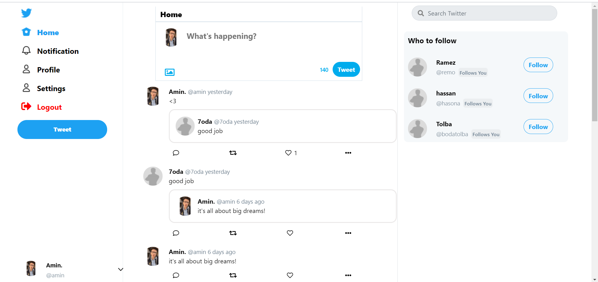
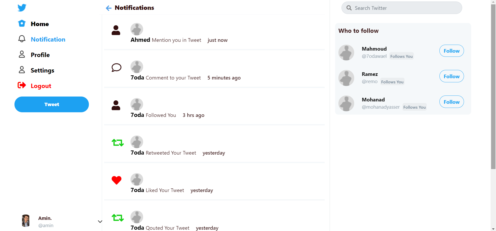
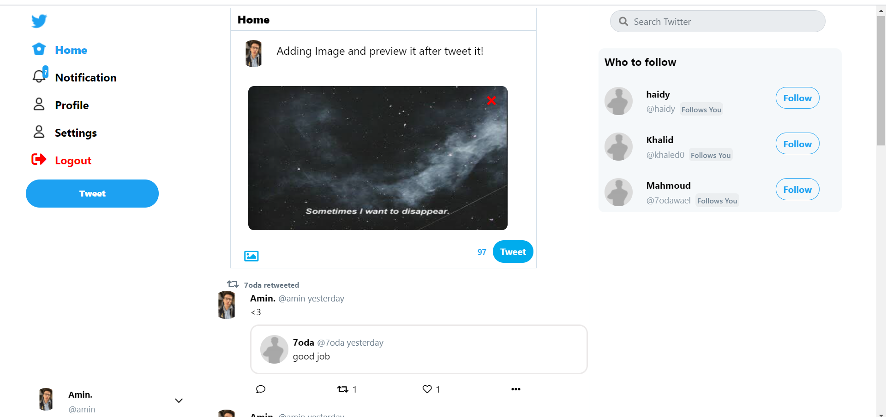

# E-commerce
This project are used to HTML, CSS, PHP (Basies) and Javascript. 


## Running locally
 
 - Create New Database then import twitter.sql file on it.
 - go to PATH **core/classes/connection.php** and add your database info.

 ```php
    protected static $servername = "localhost";
    protected static $db_name="twitter";
    protected static $username = "root";
    protected static $password = "";
```
 then the project is ready to run in localhost!

## 📷 UI


### Index


### Home


### Tweet and Comments


### Profile


### Notifications


### Edit Account


### Preview Image before Tweet


### Users List (For following/likedby etc)


### Setting
 


