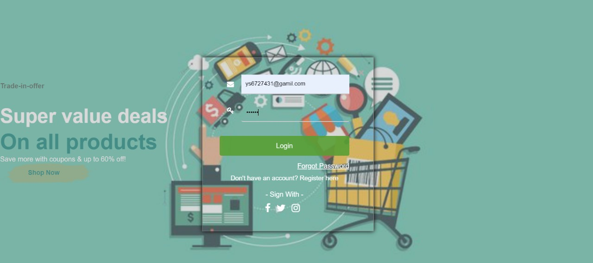

# E-commerce
Description: The Project is related to E-Commerce website. Ecommerce is a method of buying and selling goods and services online. The definition of ecommerce business can also include tactics like affiliate marketing. 

Tools used: PHP7, HTML5, JavaScript (JQuery, Bootstrap), CSS3, MySQL

Learning Outcome: Identify the component parts of e-commerce Identify the benefits of selling online Know how to optimise and stay safe when selling online Have an outline strategy for eCommerce for your business.


## Running locally
 
 - Create New Database (e_commerce) then import E_Commerce.sql file on it.
 - go to PATH **core/classes/connection.php** and add your database info.

 ```php
    protected static $servername = "localhost";
    protected static $db_name="twitter";
    protected static $username = "root";
    protected static $password = "";
```
 then the project is ready to run in localhost!

## 📷 UI

### Home


### Products 


### Arrivals 


### model 


### Login and Register



### Dhashbord


### Product Details


### Payment and cart
 


### CONCLUSION

E-commerce still represents one of the business methods that take advantage if done the right way, even if the stock market and commodities fell, but E-Commerce still able to survive and receive high transaction. E-commerce has a tremendous opportunity in the course of or business in Malaysia. In addition, it is also to introducing new techniques and styles in a transaction. Use the extensive E-Commerce in the Internet world is actually much better to bring the goodness of the individual or the state.

E-Commerce has undeniably become an important part of our society. The successful companies of the future will be those that take E-Commerce seriously, dedicating sufficient resources to its development. E-Commerce is not an IT issue but a whole business undertaking. Companies that use it as a reason for completely re-designing their business processes are likely to reap the greatest benefits. Moreover, E-Commerce is a helpful technology that gives the consumer access to business and companies all over the world.

### References

PHP: https://www.php.net/
W3School: https://www.w3schools.com/php/
javaTpoint: https://www.javatpoint.com/php-tutorial
TutorialsPoint: https://www.tutorialspoint.com/php/index.htm 

